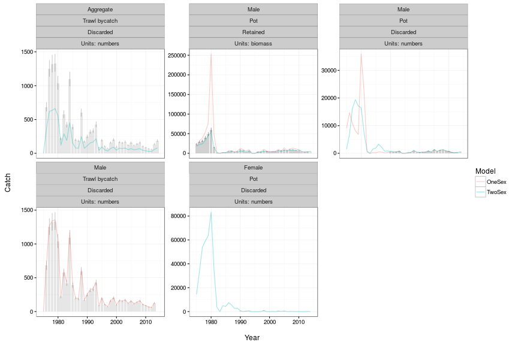
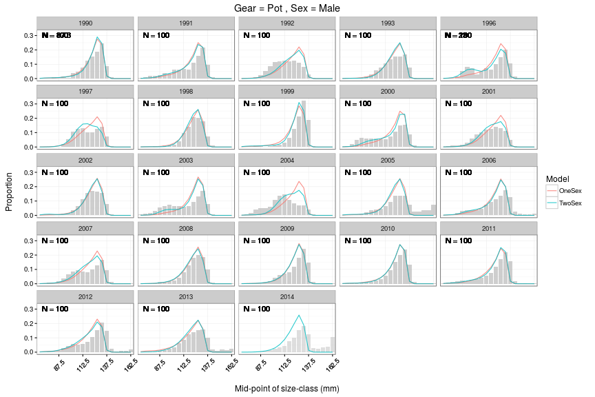
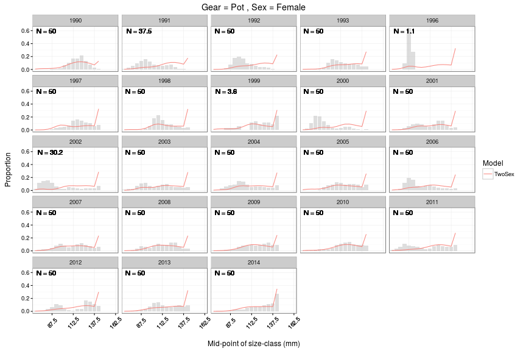
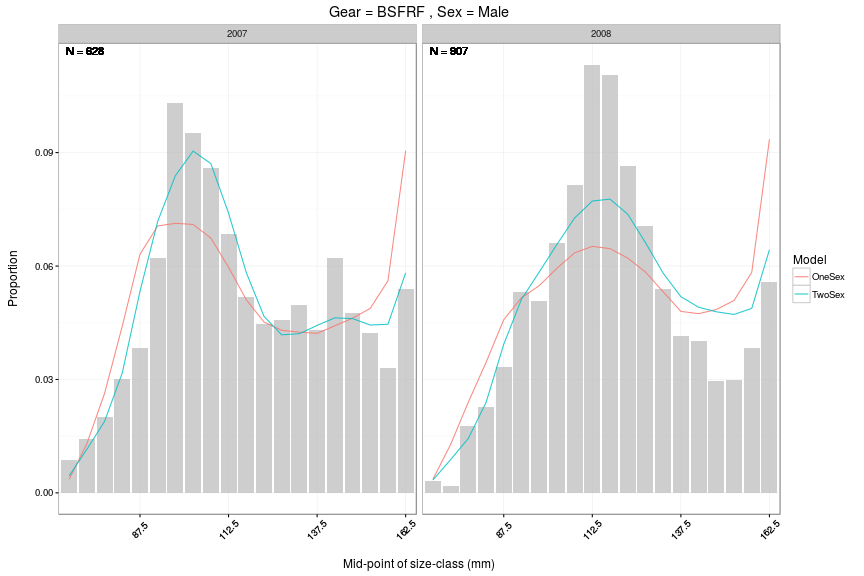
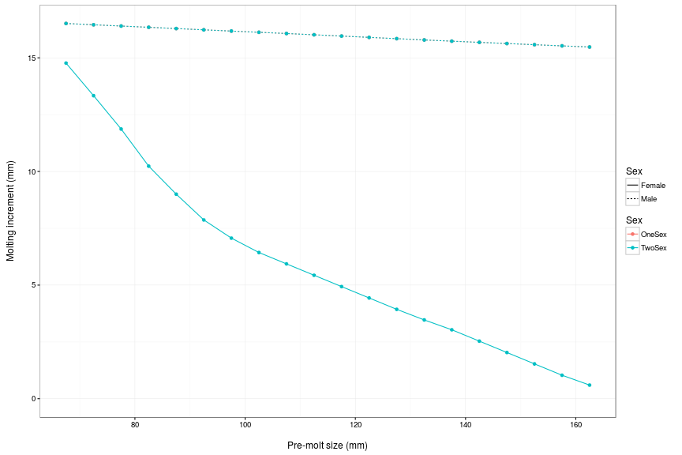
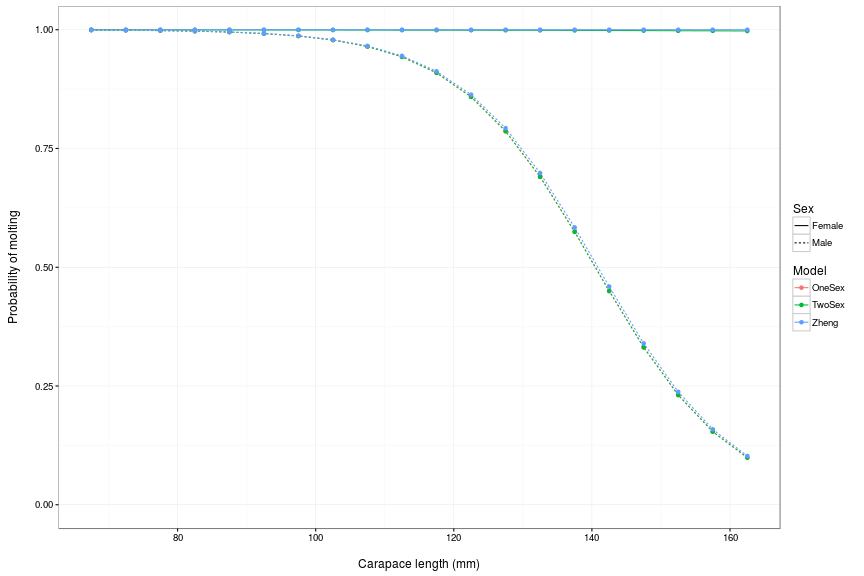
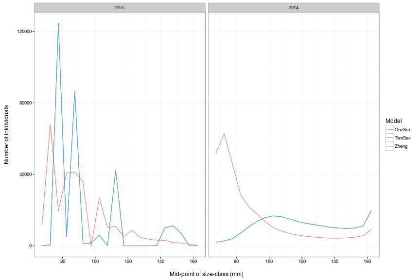
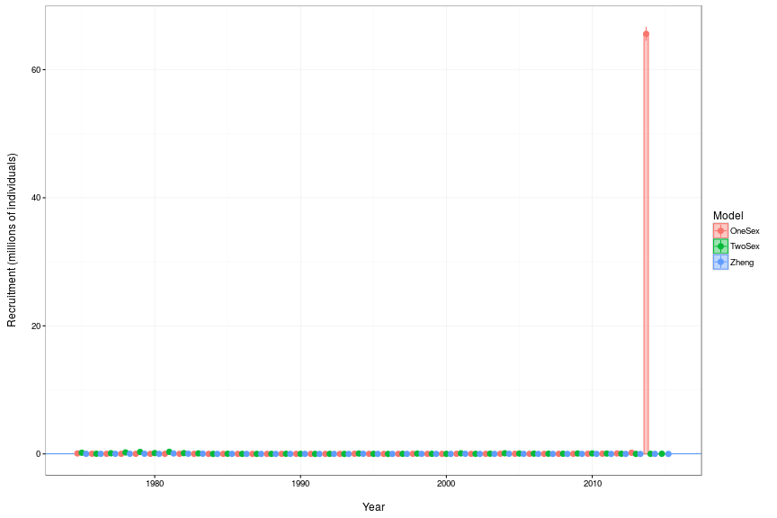

# Introduction

Gmacs is a generalized size-structured stock assessment modeling framework for
molting crustacean species. Gmacs can make use of a wide variety of data,
including fishery- and survey-based size-composition data, and fishery-
dependent and -independent indices of abundance. Gmacs is coded using AD Model
Builder [@Fournier2012b].

Crab stocks of Alaska are managed by the North Pacific Fisheries Management
Council ([NPFMC](http://npfmc.org)). Some stocks are assessed with integrated
size-structured assessment models of the form described in @punt_review_2013.
Currently, each stock is assessed using a stock-specific assessment model
(e.g. @zheng_bristol_2014). The Gmacs project aims to provide software that
will allow each stock to be assessed independently but using a single flexible
modeling framework.

This application is developed to compare with the current assessment model for
the Bristol Bay Red King Crab (BBRKC) stock. The example assessment is
intended to match closely with a model scenario presented to the Fall 2014
BSAI Crab Plan Team Meeting by @zheng_bristol_2014. The following summarizes
the outcome of some comparisons between the existing BBRKC stock assessment
model [@zheng_bristol_2014] and an emulated version using the Gmacs platform.

An important component of the Gmacs framework is the provision of software for
plotting Gmacs model outputs and incorporating model outputs directly into
documentation. In what follows, we demonstrate the use of the `gmr` package to
process the output of the Gmacs-BBRKC model and produce plots that can be used
in assessment reports.

The Gmacs-BBRKC model presented here is intended to be an example comparison
which may  follow for application to other crab stocks. We provide some direct
model comparisons to  illustrate the efficacy of Gmacs and show how
alternative models can be specified (but please see
[Wiki](https://github.com/seacode/gmacs/wiki) for up to date details of model
specification and estimation).

## New features

New features added to Gmacs since the CIE review include:

  * Improved **control over selectivity specification** including: sex-specific parameter
   specification (allowing sex-specific retention as well); lower and upper bound specification for 
   each selectivity parameter; priors for each selectivity parameter; provision for additional 
   selectivity types (i.e. coefficient selectivity and double normal).
  * Improved **control over fitting of size composition** data including: the ability to aggregate size 
  compositions (e.g. male and female size compositions from the same fishery) and fit them 
  simultaneously within the multivariate distribution of choice; improvements to output files that are read into R for 
  automated plotting of the observed and expected size compositions.
  * **Prior specification explicit** now for all model parameters.
  * Option to provide a **vector of weight at size** rather than parameters.
  * Diagnostic "gradient.dat" at run completion has been added to help isolate parameters that are resulting in poor estimation properties.
  * A reference list `Gmacs.bib` containing references important to crab modeling and length-structured models in general.

These new features have greatly improved the flexibility of the Gmacs modeling framework.

## In development
Some other features requested by the NPFMC Crab Plan Team (CPT) and CIE reviews 
that are presently under development include:

  * Double-normal and non-parametric selectivity types
  * Additional time-varying options for molt, growth and maturity
  * Dirichlet size composition option for likelihoods
  * Allowing additional variances to be estimated for abundance indices
  * Fully Bayesian MCMC functionality
  * A new series of MCMC diagnostic plots including plots of MCMC traces, histograms with priors 
  overlayed, correlation plots, data and posterior predictive distributions
  * Adding diagnostics of likelihood fitting properties

## Summary of analytical approach

To reduce annual measurement errors associated with abundance estimates
derived from the area-swept method, the ADFG developed a length-based analysis
(LBA) in 1994 that incorporates multiple years of data and multiple data
sources in the estimation procedure (Zheng et al. 1995a). Annual abundance
estimates of the BBRKC stock from the LBA have been used to manage the
directed crab fishery and to set crab bycatch limits in the groundfish
fisheries since 1995. An alternative LBA (research model) was developed in
2004 to include small size groups for federal overfishing limits. The crab
abundance declined sharply during the early 1980s. The LBA estimated natural
mortality for different periods of years, whereas the research model estimated
additional mortality beyond a basic constant natural mortality during
1976-1993.

The original LBA model was described in detail by Zheng et al. (1995a, 1995b)
and Zheng and Kruse (2002). The model combines multiple sources of survey,
catch, and bycatch data using a maximum likelihood approach to estimate
abundance, recruitment, catchabilities, catches, and bycatch of the commercial
pot fisheries and groundfish trawl fisheries.

Critical assumptions of the model include:

  * The base natural mortality is constant over shell condition and size and was
    estimated assuming a maximum age of 25 and applying the 1% rule (Zheng
    2005).
  * Survey and fisheries selectivities are a function of size and were constant
    over shell condition.  Selectivities are a function of sex except for trawl
    bycatch selectivities, which are the same for both sexes. Two different
    survey selectivities were estimated: (1) 1975-1981 and (2) 1982-2013 based
    on modifications to the trawl gear used in the assessment survey. _Note: in 
    the current assessment the survey selectivity asymptotes at 0.94 which may affect
    interpretation of the survey catchability_
  * Growth is a function of size and is constant over time for males. For
    females, three growth increments per molt as a function of size were
    estimated based on sizes at maturity (1975-1982, 1983-1993, and
    1994-2013). Once mature, female red king crabs grow with a much smaller
    growth increment per molt. _Note: this feature for dimorphic time-varying growth
    is currently unavailable in Gmacs_
  * Molting probabilities are an inverse logistic function of size for
    males. Females molt annually.
  * Annual fishing seasons for the directed fishery are short. _Note: Gmacs uses
    the Baranov catch equation though options for developing pulse sequential forms are 
    in development_
  * Survey catchability ($q$) was estimated to be 0.896, based on a trawl
    experiment by Weinberg et al. (2004) with a standard deviation
    of 0.025. Survey catchability was assumed to be constant over time. Some
    scenarios estimate $q$ in the model.
  * Males mature at sizes = 120 mm CL. For convenience, female abundance was
    summarized at sizes = 90 mm CL as an index of mature females. For
    summer trawl survey data, shell ages of newshell crabs were 12 months or
    less, and shell ages of oldshell and very oldshell crabs were more than 12
    months.
  * Measurement errors were assumed to be normally distributed for size
    compositions and log-normally distributed for biomasses.

# Gmacs model configurations

The data and model specifications used in the Gmacs-BBRKC model were patterned
after those in the '4nb' scenario developed by @zheng_bristol_2014, herein
referred to as the BBRKC model. The BBRKC model treats recruits independently
by sex along with sex-specific natural mortality ($M$) and fishing mortality
($F$). Presently, the split-sex options in Gmacs only allows the  assumption
that the sex ratio at recruitment is 50:50. After recruiting, sexual dimorphic
growth and mortality along with fishery effects can play a role in changes in
sex ratio over time.  In an attempt to provide a comparison with the male-
component of the BBRKC model,  we drafted one Gmacs configuration as a "male-
only" or single sex model in addition to  the split two-sex Gmacs
configuration. Also for illustration purposes, the period and extent of data
for the single-sex model was extended back to 1953. A full comparison of the
approaches are shown in the following table:

Specification        | Parameter | ADFG Value | Gmacs OneSex | Gmacs TwoSex
-------------------- | --------- | ---------- | ------------ | ------------
Start year           | $t=0$     | 1975       | 1953         | 1975        
End year             | $t=T$     | 2014       | 2014         | 2014        
No. sexes            | $s$       | 2          | 1            | 2           
No. shell conditions | $\nu$     | 2          | 2            | 2           
No. maturity classes | $m$       | 2          | 1            | 1           
No. size-classes     | $\ell$    | 20         | 20           | 20          
No. Fleets           | $k$       | 5          | 2            | 5            

# Comparison of model results
The following plots summarize plots made using `gmr` based on output from
@zheng_bristol_2014 and Gmacs. Two Gmacs models are presented, the OneSex model
and the TwoSex model.

## Fit to survey abundance indices
In both the OneSex and TwoSex models priors were placed on $q$ for the NMFS
and BSFRF trawl surveys. A normal prior for the NMFS trawl survey was used
with $\mu = 0.843136$ (i.e. $0.896 \times 0.941$ which is the maximum
selectivity of the NMFS survey in Jies model) and $\sigma = 0.01$. A normal
prior is also used for the BSFRF trawl survey with  $\mu = 1$ and $\sigma =
0.03$.

The Gmacs model fits to survey biomass was somewhat better in the @zheng_bristol_2014
model (at least visually) than for either of the current implementations of
Gmacs (Figure \ref{fig:survey_biomass}).

 

## Estimated retained catch and discards 

There are four fisheries defined in each of the models: the directed pot
fishery, the groundfish trawl bycatch, the NMFS trawl surveys, and the BSFRF
surveys. Each fishery has a mean fishing mortality with annual deviations. The
observed and predicted catches by gear type are summarized in (Figure
\ref{fig:fit_to_catch}). Data for discard fisheries were read in with 100%
mortality (as clarified in Table 1 of @zheng_bristol_2014).

 

## Fit to size composition data

The fit of the Gmacs models to the BBRKC size composition data are shown in
the following plots. These include fits to the directed pot fishery for males
(Figure \ref{fig:sc_pot_m}), male crabs discarded in the directed pot fishery
(Figure \ref{fig:sc_pot_discarded_m}), female crabs discarded in the directed
pot fishery (Figure \ref{fig:sc_pot_discarded_f}), the groundfish trawl
bycatch fisheries for males (Figure \ref{fig:sc_trawl_bycatch_m}) and females
(Figure \ref{fig:sc_trawl_bycatch_f}), the NMFS trawl survey for newshell
males (Figure \ref{fig:sc_NMFS_nm}), oldshell males (Figure
\ref{fig:sc_NMFS_om}) and females (Figure \ref{fig:sc_NMFS_f}), and the BSFRF
survey (Figure \ref{fig:sc_BSFRF}).

All size composition data were fitted using the robust multinomial
distribution. In the OneSex model, new shell and old shell males were fitted
simultaneously. In the TwoSex model the following size compositions were
fitted simultaneously: discarded males and females; trawl bycatch males and
females; NMFS trawl survey new shell males together with old shell males and
females. The plots shown below have been normalized for display purposes. _In
future plotting versions the scales will be retained as an option_.

 

 

 

 

 

 

 

 

 

## Mean weight-at-size

The mean weight-at-size ($w_\ell$) is defined in kg and the carapace length
($\ell$, CL) in mm. The mean weight-at-size used in all models is set to be
identical to that of the BBRKC model (Figure \ref{fig:length-weight}).

There are differences between immature and mature females hence the unusual
shape of the length-weight relationship for females [@zheng_bristol_2014].
Given a size, once females mature with eggs, they are heavier than immature
females. BBRKC uses immature mean weight-at-size for females < 90 mm and mature
mean weight- at- size for females > 89 mm. The last four values of mean
weight-at-size for females are effectively excluded (they exceed the last
observed length group),  so the plus group value is simply repeated.  In
future versions, when the immature and mature females are modeled separately,
two mean weight- at-size functions can be used. The mean weights for both male
and female plus length groups are higher than the function values to reflect
that there are more crabs larger than the plus group mid sizes. This
adjustment is based on the survey length frequency data over time.

 

## Initial recruitment size distribution
Gmacs was configured to match the @zheng_bristol_2014 model recruitment size
distribution closely (Figure \ref{fig:init_rec}).

 

## Molting increment and probability

In the BBRKC model one functional for for growth increment per molt is used
for males and three functions for females (due to changing sizes at maturity).

Options to fit relationship based on data were developed within Gmacs but for
the BBRKC system, a size-specific vector was used to determine molt increments
as shown below (Figure \ref{fig:growth_inc}). Fixed parameters in gmacs were
set to match assumptions in @zheng_bristol_2014 (Figure \ref{fig:molt_prob}).

 

In the BBRKC model, females are specified to molt annually consistent with
their biology. This means that molting probability is always 1 for females and
was replicated in the Gmacs model by fixing the logistic curves parameters to
values that result in the molting probability being 1 for females across all
modeled length classes. Male BBRKC molting patterns differ from females. As
such, the BBRKC  model was specified to have two molting probability curves,
one during 1975-78 and another from 1979 to the present. _For the current
version of Gmacs, only a single molting probability curve is allowed_.

 

## Transition processes

The first set of figures is the growth probabilities (for all crabs that molt)
(Figure \ref{fig:growth_trans}). The second set of figures is the combination
of growth and molting probabilities and represents the size transition (Figure
\ref{fig:size_trans}).

 

 

## Numbers at length in the first and last year

Total abundance and the proportions by length and sex are estimated in 1975
(the models initial year).

The number of crabs in each size class (${\bf n}$) in the initial year ($t=1$)
and final year ($t=T$) in each model differ substantially (Figure
\ref{fig:init_N}). The scale of these results differ significantly and may be
related to the interaction with natural mortality estimates and how the initial
population-at-lengths were established (the BBRKC model assumes all new-shell).

 

## Selectivity

The selectivity by size ($S_\ell$) for each of the fisheries (Figure
\ref{fig:selectivity}). In the TwoSex model, selectivity in the directed pot
fishery is sex-specific. In the remaining fisheries, selectivity is constant
by sex. In the NMFS trawl fishery, a different selectivity curve is estimated
for the 1975-1981 period and for the 1982-2014 period.

 

## Natural mortality

The figure below illustrates implementation of four step changes in $M_t$
(freely estimated) in gmacs relative to the estimates from Zheng et al. 2014
(Figure \ref{fig:M_t}). In both the ADFG-BBRKC and Gmacs-BBRKC models, time-
varying natural mortality ($M_t$) is freely estimated with four step changes
through time. The years ($t$) that each of these steps cover are fixed a
priori. The pattern in time-varying natural mortality is reasonably similar
between the two models (Figure \ref{fig:M_t}), however the peak in natural
mortality during the early 1980 is not as high in the Gmacs-BBRKC model. _In
the Gmacs model, a spline function for natural mortality changes over time is
an available as an option._

 

## Recruitment

Recruitment ($R_t$) patterns are similar among models, but differences in
natural mortality schedules will affect these matches. The figure below shows
that the values have roughly the same mean (Figure \ref{fig:recruitment}).

 

## Mature male biomass (MMB)

The spawning stock biomass (tons) of mature males, termed the mature male
biomass ($\mathit{MMB}_t$), varies some between the models (Figure
\ref{fig:ssb}).

 

## Comparison of likelihoods between models

In the tables below the OneSex and TwoSex model likelihoods (Table
\ref{tab:likelihoods}) and penalties (Table \ref{tab:penalties}) are compared.

\begin{table}[ht]
\centering
\caption{Likelihoods in log-space.} 
\begin{tabular}{lrr}
  \hline
 & OneSex & TwoSex \\ 
  \hline
Abundance1 & 26.78 & 172.25 \\ 
  Abundance2 & -1.25 & -1.25 \\ 
  Catch1 & 89.10 & 582.80 \\ 
  Catch2 & 92.18 & 228.63 \\ 
  Catch3 & -78.75 & -49.78 \\ 
  Catch4 &  & -78.67 \\ 
  Growth increment1 & 0.00 & 0.00 \\ 
  Recruitment deviations1 & 117.45 & 255.97 \\ 
  Size composition1 & 445.35 & 571.10 \\ 
  Size composition2 & 1097.31 & 3879.39 \\ 
  Size composition3 & 1011.17 & 2341.26 \\ 
  Size composition4 & 41504.62 & 31257.80 \\ 
  Size composition5 & 14.24 & 247.68 \\ 
   \hline
\end{tabular}
\end{table}

\begin{table}[ht]
\centering
\caption{Penalties in log-space.} 
\begin{tabular}{lrr}
  \hline
 & OneSex & TwoSex \\ 
  \hline
log\_fdev & 0.00 & 0.00 \\ 
  mean F & 9.47 & 9.47 \\ 
  M & 24.00 & 12.44 \\ 
  rec\_dev & 0.00 & 0.00 \\ 
  rec\_ini & 0.00 & 0.00 \\ 
  rec\_dev\_ & 55.42 & 56.49 \\ 
   \hline
\end{tabular}
\end{table}

# Discussion

Comparisons of likelihood function components are available from the output
but more  detailed evaluation is needed. Simulation testing is also slated for
evaluating alternative model specifications for robustness (e.g., constant
natural mortality over time, time-varying selectivity, etc).

The current Gmacs models require that many of the key model parameters be fixed to
obtain model fits that look similar to the BBRKC model.

# References

