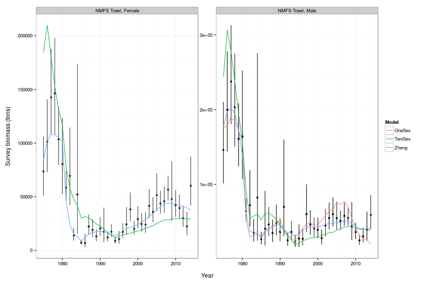
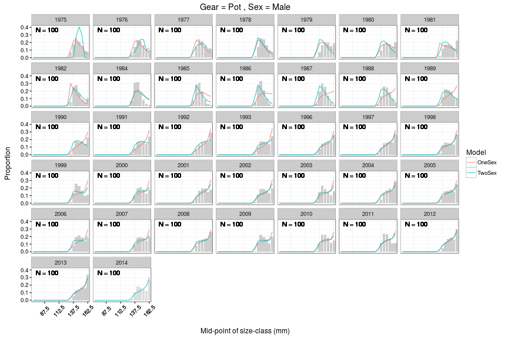
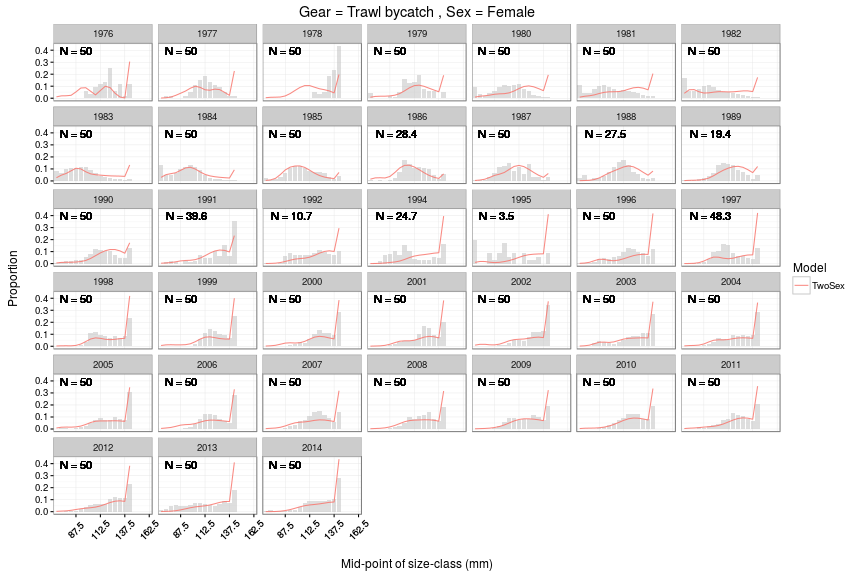
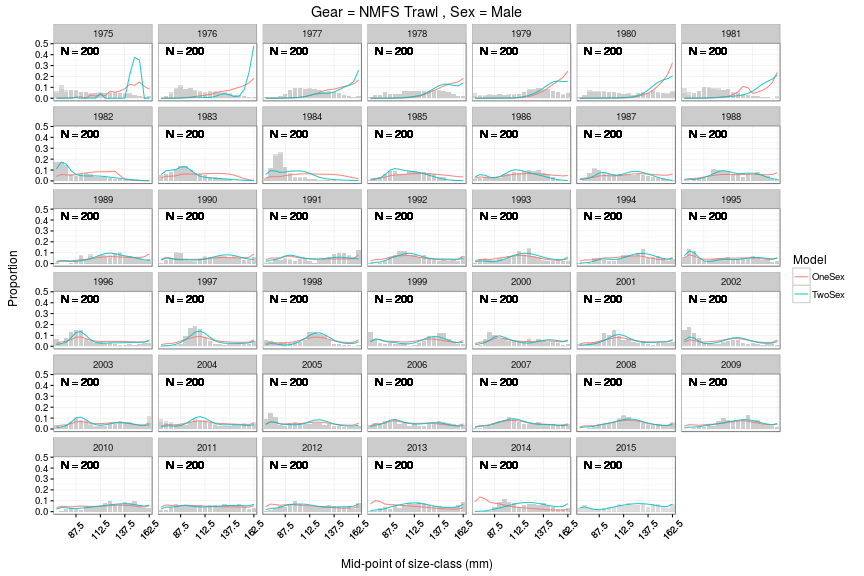
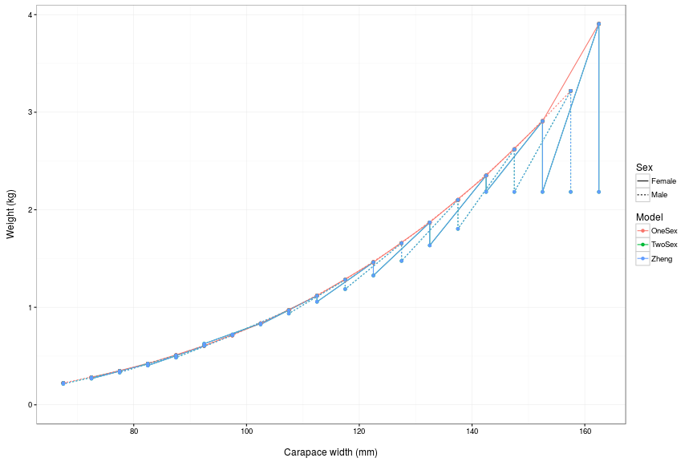
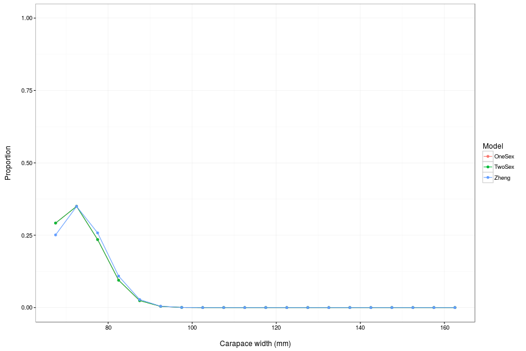
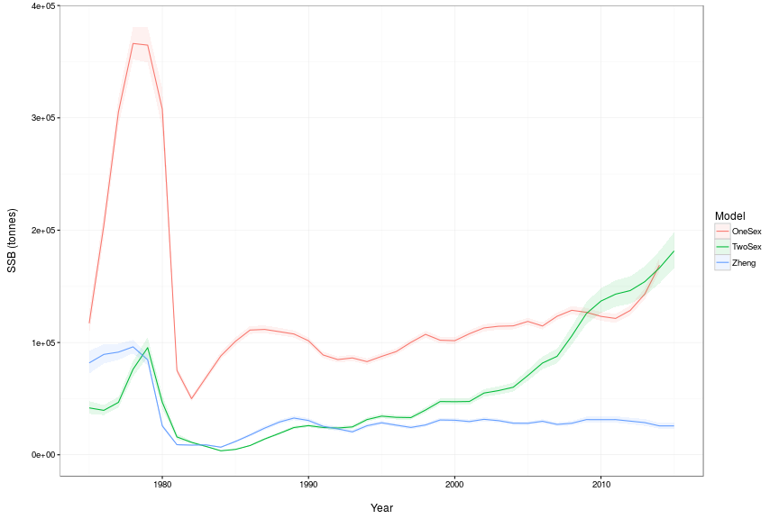

# Introduction

Gmacs is a generalized size-structured stock assessment modeling framework for
molting crustacean species. Gmacs can make use of a wide variety of data,
including fishery- and survey-based size-composition data, and fishery-dependent
and -independent indices of abundance. Gmacs is coded using AD Model Builder.

Crab stocks of Alaska are managed by the North Pacific Fisheries Management
Council ([NPFMC](http://npfmc.org)). Some stocks are assessed with integrated
size-structured assessment models of the form described in @punt_review_2013.
Currently, each stock is assessed using a stock-specific assessment model
(e.g. @zheng_bristol_2014). The Gmacs project aims to provide software that
will allow each stock to be assessed independently but using a single
modeling framework.

Gmacs is used here to develop an assessment model for the Bristol Bay Red King
Crab (BBRKC) stock. The example assessment is intended to match closely with a
model scenario presented to the Fall 2014 BSAI Crab Plan Team Meeting by
@zheng_bristol_2014. The following summarizes the outcome of some comparisons
between the existing BBRKC stock assessment model [@zheng_bristol_2014] and an
emulated version using the Gmacs platform.

An important component of the Gmacs framework is the provision of software for
plotting Gmacs model outputs. In what follows, we demonstrate the use of the
`gmr` package to process the output of the Gmacs-BBRKC model and produce plots
that can be used in assessment reports.

Together, the Gmacs-BBRKC model and this report serve as the first example of
what should follow for other crab stocks: that is, direct model comparisons to
(1) test the efficacy of Gmacs, and (2) determine whether Gmacs can be used in
practice to closely match the outputs of existing ADFG stock assessment models.

## New features

New features added to Gmacs since the CIE review include:

  * Improved control over selectivity specification including: sex-specific parameter specification (allowing sex-specific retention); lower and upper bound specification for each selectivity parameter; priors for each selectivity parameter; provision for additional selectivity types (i.e. coefficient selectivity and double normal).
  * Improved control over fitting of size composition data including: the ability to aggregate size compositions (e.g. male and female size compositions from the same fishery) and fit them simultaneously within the multivariate distribution of choice; output files that are read into R for automated plotting of the observed and expected size compositions.
  * Prior specification for all model parameters.
  * Ability to provide a vector of weight at size rather than parameters

## Coming soon

New features that will be coming soon include:

  * Double normal and coefficient selectivity types
  * Dirichlet size composition option
  * Additional time-varying options for molt, growth and maturity
  * Allowing additional variances to be estimated for abundance indices
  * Fully Bayesian MCMC functionality
  * Please feel free to make suggestions

## Summary of analytical approach

To reduce annual measurement errors associated with abundance estimates derived
from the area-swept method, the ADFG developed a length-based analysis (LBA) in
1994 that incorporates multiple years of data and multiple data sources in the
estimation procedure (Zheng et al. 1995a). Annual abundance estimates of the
BBRKC stock from the LBA have been used to manage the directed crab fishery and
to set crab bycatch limits in the groundfish fisheries since 1995. An
alternative LBA (research model) was developed in 2004 to include small size
groups for federal overfishing limits. The crab abundance declined sharply
during the early 1980s. The LBA estimated natural mortality for different
periods of years, whereas the research model estimated additional mortality
beyond a basic constant natural mortality during 1976-1993.

The original LBA model was described in detail by Zheng et al. (1995a, 1995b)
and Zheng and Kruse (2002). The model combines multiple sources of survey,
catch, and bycatch data using a maximum likelihood approach to estimate
abundance, recruitment, catchabilities, catches, and bycatch of the commercial
pot fisheries and groundfish trawl fisheries.

Critical assumptions of the model include:

  * The base natural mortality is constant over shell condition and size and was
    estimated assuming a maximum age of 25 and applying the 1% rule (Zheng
    2005).
  * Survey and fisheries selectivities are a function of size and were constant
    over shell condition.  Selectivities are a function of sex except for trawl
    bycatch selectivities, which are the same for both sexes. Two different
    survey selectivities were estimated: (1) 1975-1981 and (2) 1982-2013 based
    on modifications to the trawl gear used in the assessment survey.
  * Growth is a function of size and did not change over time for males. For
    females, three growth increments per molt as a function of size were
    estimated based on sizes at maturity (1975-1982, 1983-1993, and
    1994-2013). Once mature, female red king crabs grow with a much smaller
    growth increment per molt.
  * Molting probabilities are an inverse logistic function of size for
    males. Females molt annually.
  * Annual fishing seasons for the directed fishery are short.
  * Survey catchability ($q$) was estimated to be 0.896, based on a trawl
    experiment by Weinberg et al. (2004) with a standard deviation
    of 0.025. Survey catchability was assumed to be constant over time. Some
    scenarios estimate $q$ in the model.
  * Males mature at sizes =120 mm CL. For convenience, female abundance was
    summarized at sizes =90 mm CL as an index of mature females.  viii. For
    summer trawl survey data, shell ages of newshell crabs were 12 months or
    less, and shell ages of oldshell and very oldshell crabs were more than 12
    months.
  * Measurement errors were assumed to be normally distributed for size
    compositions and were log- normally distributed for biomasses.

# Gmacs

The data and model specifications used in the Gmacs-BBRKC model are very
similar to those used in the '4nb' scenario developed by @zheng_bristol_2014,
herein referred to as the BBRKC model. The BBRKC model from
@zheng_bristol_2014 treats recruits by sex along with sex-specific natural
mortality and fishing mortality. Here we provide results from two different
Gmacs models (1) a two-sex model and (2) a single sex model in which the male
components are compared with results from a Gmacs model implementation tuned
to male-only data.

Parameter Number of estimated parameters Value Natural mortality 1 Males
(1980-84) 1 Females (1980-84) 1 Females (1976-79; 1984-1993) 0.18 yr-1 Other
years

In the BBRKC model, females molt annually, so molting probability is always 1
for females. This was replicated in the Gmacs model by fixing the logistic
curves parameters to values that result in the molting probability being 1 for
females across all modeled length classes. For the males, the BBRKC model has
two molting probability curves, one during 1975-78 and another during
1979-present, each with two logistic curve parameters.  In the current version
of Gmacs, only a single molting probability curve is modeled.

The growth increment per molt is one function for males and three functions
for females (due to changing sizes at maturity).

Each fishery has a mean fishing mortality with annual deviations. Describe
selectivity.

Total abundance and the proportions by length and sex are estimated in 1975
(the models initial year).

Comparison tables of two different model approaches could be done by

Pot fishery, trawl bycatch, NMFS trawl, BSFRF

Specification        | Parameter | ADFG Value | Gmacs OneSex | Gmacs TwoSex
-------------------- | --------- | ---------- | ------------ | ------------
Start year           | $t=0$     | 1975       | 1953         | 1975        
End year             | $t=T$     | 2014       | 2014         | 2014        
No. sexes            | $s$       | 2          | 1            | 2           
No. shell condition  | $\nu$     | 2          | 2            | 2           
No. maturity classes | $m$       | 2          | 1            | 1           
No. size-classes     | $\ell$    | 20         | 20           | 20          
No. Fleets           | $k$       | 5          | 2            | 5            

Life History Trait | Parameter | ADFG Value | Gmacs Value | Comments
------------------ | --------- | ---------- | ----------- | --------
Natural Mortality  | M         | Fixed      | Fixed       | M is fixed in both models

## File Description

  * There is a second data file `rksize13s.dat` with sample sizes for 
    various rows of size-comp data. See lines 81-87 of `*.tpl`. 
  * Input sample sizes appear to be capped to the constant numbers entered in 
    the main data file under 'number of samples' or 'sample sizes' (variously).
  * There is a third data file `tc7513s.dat` specifically for data from the
    tanner crab fishery (with red crab bycatch).
  * There is a standard control file `*.ctl` with internal comments.
  * There is an excel spreadsheet which can be used to read in the model
    output files and display related plots (it's a bit clunky).
  * There are two batch files in the model directory: `clean.bat` and `scratch.bat`.
    The 'clean' batch file deletes files related to a single model run. The
    'scratch' batch file deletes all files relating to the model build and 
    leaves only source and data files.

# Comparison of model results

The following plots summarize plots made using `gmr` based on output from
@zheng_bristol_2014 and Gmacs. Two Gmacs models are provided, the OneSex model
and the TwoSex model.

## Fit to survey abundance indices

The model fit to survey biomass for males was XXX in the @zheng_bristol_2014
model (at least visually) than for either of the current implementations of
Gmacs (Figure \ref{fig:survey_biomass}).

 

## Estimated retained catch and discards

The observed and predicted catches by gear type are summarized in (Figure
\ref{fig:fit_to_catch}). Data for discard fisheries were read in with 100%
mortality (as clarified in Table 1 of @zheng_bristol_2014).

 

## Fit to size composition data

The fit of the Gmacs models to the BBRKC size composition data are given in the
following plots. These include fits to the directed pot fishery for males
(Figure \ref{fig:sc_pot_m}), male crabs discarded in the directed pot fishery
(Figure \ref{fig:sc_pot_discarded_m}), female crabs discarded in the directed
pot fishery (Figure \ref{fig:sc_pot_discarded_f}), the groundfish trawl bycatch
fisheries for males (Figure \ref{fig:sc_trawl_bycatch_m}) and females (Figure
\ref{fig:sc_trawl_bycatch_f}), and the NMFS trawl survey (Figure
\ref{fig:sc_NMFS_m}).

All size composition data were fitted using the robust multinomial
distribution. In the OneSex model, new shell and old shell males were fitted
simultaneously. In the TwoSex model the following size compositions were
fitted simultaneously: discarded males and females; trawl bycatch males and
females; NMFS trawl survey new shell males, old shell males and females.

 

 

 

 

 

 

 

 

 

## Mean weight-at-size

The mean weight-at-size ($w_\ell$) is defined in kg and the carapace length
($\ell$, CL) in mm. The mean weight-at-size used in all models is identical
because the new option to provide a vector of weights at length is used
(Figure \ref{fig:length-weight}).

There are differences between immature and mature females hence the unusual
shape of the length-weight relationship for females. Given a size, once
females mature with eggs, they are heavier than immature females. ADFG uses
immature mean weight-at-size for females < 90 mm and mature mean weight- at-
size for females > 89 mm. The last four values of mean weight-at-size for
females are not used (exceeding the last length group), so the plus group
value is simply repeated. In the future, when the immature and mature females
are modeled separately, two mean weight- at-size functions should be used. The
mean weights for both male and female plus length groups are higher than the
function values to reflect that there are more crabs larger than the plus
group mid sizes. The adjustment is based on the survey length frequency data
over time.

 

## Initial recruitment size distribution

Gmacs was configured to match the @zheng_bristol_2014 model recruitment size
distribution closely (Figure \ref{fig:init_rec}).

 

## Molting increment and probability

Options to fit relationship based on data was developed but for the BBRKC
system, a size-specific vector was used to determine molt increments as shown
below (Figure \ref{fig:growth_inc}). Fixed parameters in gmacs were set to
represent that assumed from @zheng_bristol_2014 (Figure \ref{fig:molt_prob}).

 

 

## Transition processes

The first set of figures is the growth probabilities (for all crabs that molt)
(Figure \ref{fig:growth_trans}). The second set of figures is the combination of
growth and molting and represents the size transition (Figure
\ref{fig:size_trans}).

 

 

## Numbers at length in 1975 and 2014

The number of crabs in each size class (${\bf n}$) in the initial year ($t=1$)
and final year ($t=T$) in each model differ substantially (Figure
\ref{fig:init_N}). The scale of these results differ significantly and may be
related to the interaction with natural mortality estimates and how the initial
population-at-lengths were established (the BBRKC model assumes all new-shell).

 

## Selectivity

The selectivity by size ($S_\ell$) for each of the fisheries (Figure
\ref{fig:selectivity}). In the TwoSex model, selectivity in the directed pot
fishery is sex-specific. In the remaining fisheries, selectivity is constant
by sex. In the NMFS trawl fishery, a different selectivity curve is estimated
for the 1975-1981 period and for the 1982-2014 period.

 

## Natural mortality

The figure below illustrates implementation of four step changes in $M_t$
(freely estimated) in gmacs relative to the estimates from Zheng et al. 2014
(Figure \ref{fig:M_t}). In both the ADFG-BBRKC and Gmacs-BBRKC models,
time-varying natural mortality ($M_t$) is freely estimated with four step
changes through time. The years ($t$) that each of these steps cover are fixed a
priori. The pattern in time-varying natural mortality is reasonably similar
between the two models (Figure \ref{fig:M_t}), however the peak in natural
mortality during the early 1980 is not as high in the Gmacs-BBRKC model.

 

## Recruitment

Recruitment patterns are similar, but differences in natural mortality
schedules will affect these matches. The figure below plots the values to have
the same mean (Figure \ref{fig:recruitment}). Patterns in recruitment through
time ($R_t$) estimated in the two models are similar, but differences in
natural mortality schedules will affect these matches (Figure
\ref{fig:recruitment}).

 

## Mature male biomass (MMB)

The spawning stock biomass (tonnes) of mature males, termed the mature male
biomass ($\mathit{MMB}_t$), also differs a lot bewteen the two models (Figure
\ref{fig:ssb}). The OneSex model is not plotted here as the uncertainty during
the early years is extremely high. The Zheng model is plotted without
uncertainty.

 

## Comparison of model results

The results of the ADFG-BBRKC model are compared here to the results of the
Gmacs-BBRKC model.

Model           | FSPR | BSPR     | FOFL | OFL     | RSPR
--------------- | ----:| --------:| ----:| -------:| --------:
Gmacs (one sex) | 0.28 | 32995.95 | 0.28 | 3373.93 | 8160.40
Gmacs (two sex) | 0.21 | 22205.54 | 0.21 | 3030.39 | 16959.09

### Gmacs results

We need to be able to produce a table of the comparative likelihoods (by
component) of the alternative models. For best practice, just try and do what we
do with SS models for SESSF stocks anyway. See the pink link report, and enter a
section for each of those, and see if we can emulate a report of that type.

# Discussion

Comparisons of actual likelihood function values and year-specific fits using
the robust-multinomial would be the next step after selectivity issues are
resolved. Subsequent to that, it would be worth exploring aspects of alternative
model specifications (e.g., constant natural mortality over time, time-varying
selectivity, etc) to evaluate sensitivities.

This discussion will focus on the challenges in developing a Gmacs version of
the BBRKC model: those met, and those yet to be met.

# References
